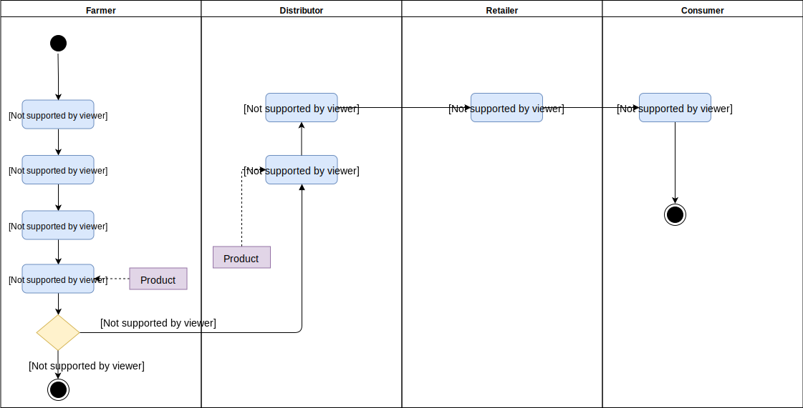
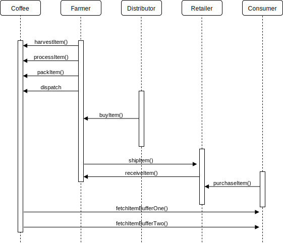

# SupplyChain

SupplyChain is a study project, create smart contract to track products using Ethereum Blockchain

## UML Diagrams

1. Activity Diagram

2. Sequence Diagram

3. State Diagram

4. Class Diagram

## Libraries

 `Roles` library is used to create diffrent roles such as Farmers, Distributor, Retailer and Consumer.

## Contract Information

Transaction ID : `0xd175bb98f8a6cd2c19f6366e0d00bb628279df911e9a454dd6a3140a5118b100`

Contract address : `0xdb64987f512efe83c6930da31f7b9e4a2075b332` 

Network : `Renkeby`

`Truffle v4.1.14`

`truffle-hdwallet-provider v1.0.13`

`web3 v0.20.7`

https://rinkeby.etherscan.io/address/0xdb64987f512efe83c6930da31f7b9e4a2075b332

## Local UI Installation

Change directory

`cd src/js`

Run local UI

`npm run dev`

